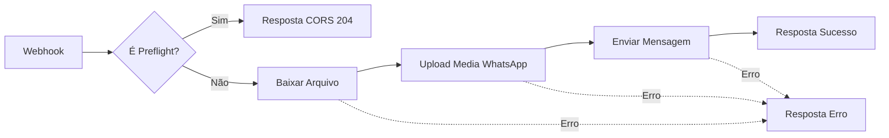

# Envio de Documentos via WhatsApp

Esta funcionalidade permite que usuários mobile enviem documentos diretamente para seu WhatsApp, resolvendo o problema de download em WebViews Android.

## Arquitetura

```
Mobile (Android WebView)
    ↓ clica "Enviar no WhatsApp"
DocumentosService.sendToWhatsApp()
    ↓ POST com telefone + URL assinada
n8n Webhook (zedasafra.app.n8n.cloud)
    ↓ download arquivo + upload p/ Meta
WhatsApp Cloud API (graph.facebook.com)
    ↓ envia mensagem
Usuário recebe arquivo no WhatsApp
```

## Configuração do n8n

### 1. Importar o Workflow

1. Acesse **zedasafra.app.n8n.cloud**
2. Vá em **Workflows** → **Import from File**
3. Selecione o arquivo `docs/n8n-workflow-whatsapp.json`

### 2. Configurar Variáveis de Ambiente

No n8n, vá em **Settings** → **Variables** e adicione:

| Variável | Descrição |
|----------|-----------|
| `WHATSAPP_PHONE_ID` | ID do número de telefone no Meta Business |
| `WHATSAPP_TOKEN` | Token de acesso permanente do WhatsApp Business API |

### 3. Ativar o Workflow

⚠️ **IMPORTANTE**: O workflow tem dois modos:

- `/webhook-test/...` — **apenas para testes manuais** (não funciona em produção!)
- `/webhook/...` — **produção** (requer workflow ativo)

**Para produção:**
1. Clique no workflow
2. Clique no toggle **Active** no canto superior direito
3. O workflow agora responde em `/webhook/enviar-documento-whatsapp`

### 4. Verificar a URL

Após ativar, a URL de produção será:
```
https://zedasafra.app.n8n.cloud/webhook/enviar-documento-whatsapp
```

## Configuração do Frontend

### Variável de Ambiente

Em produção, configure no ambiente de deploy (Vercel/Netlify):

```env
VITE_WHATSAPP_WEBHOOK_URL=https://zedasafra.app.n8n.cloud/webhook/enviar-documento-whatsapp
```

> **Nota**: Use `/webhook/` (não `/webhook-test/`)!

### Desenvolvimento Local

O Vite proxy está configurado para contornar CORS em desenvolvimento:

```typescript
// vite.config.ts - já configurado
proxy: {
  '/api/whatsapp': {
    target: 'https://zedasafra.app.n8n.cloud',
    changeOrigin: true,
    rewrite: (path) => path.replace(/^\/api\/whatsapp/, '/webhook'),
  },
}
```

## CORS em Produção

O workflow n8n inclui tratamento de CORS preflight:

1. **Requisição OPTIONS** → Responde com headers `Access-Control-Allow-*`
2. **Requisição POST** → Processa normalmente + adiciona header `Access-Control-Allow-Origin: *`

Isso permite que o frontend (`app.solos.ag`) chame o webhook diretamente.

## Fluxo do Workflow n8n



## Payload da Requisição

```json
{
  "telefone": "5511999999999",
  "arquivo_url": "https://...signed-url...",
  "titulo": "Nota Fiscal",
  "tipo_arquivo": "document",
  "mime_type": "application/pdf",
  "nome_arquivo": "nota-fiscal.pdf"
}
```

## Tipos de Arquivo Suportados

| Tipo | Extensões | `tipo_arquivo` |
|------|-----------|----------------|
| Imagem | jpg, jpeg, png, gif, webp | `image` |
| Documento | pdf, doc, docx, xls, xlsx | `document` |

## Troubleshooting

### Erro CORS em Produção

**Sintoma**: `Access to fetch ... has been blocked by CORS policy`

**Causas possíveis**:
1. Workflow não está **ativo** (ainda em modo test)
2. URL usando `/webhook-test/` em vez de `/webhook/`
3. Workflow antigo sem tratamento CORS (reimporte o JSON)

**Solução**:
1. Verifique se o workflow está ativo no n8n
2. Confirme que `VITE_WHATSAPP_WEBHOOK_URL` usa `/webhook/`
3. Reimporte `docs/n8n-workflow-whatsapp.json`

### Arquivo Não Chega no WhatsApp

**Causas possíveis**:
1. URL assinada expirou (válida por 1 hora)
2. Token do WhatsApp expirado
3. Número não cadastrado no WhatsApp Business

**Solução**:
1. Verifique execuções no n8n para ver o erro específico
2. Renove o token no Meta Business Manager
3. Confirme o número no painel do WhatsApp Business

### Logs de Debug

O `DocumentosService.sendToWhatsApp()` inclui logs detalhados:

```
[Documentos][WhatsApp] Iniciando envio do documento: 123
[Documentos][WhatsApp] Modo: production
[Documentos][WhatsApp] Webhook URL: https://...
[Documentos][WhatsApp] Payload: {...}
[Documentos][WhatsApp] Response status: 200
[Documentos][WhatsApp] Response body: {...}
```

## Meta Business Setup

### Obter Phone ID

1. Acesse [Meta Business Suite](https://business.facebook.com)
2. Vá em **WhatsApp** → **Configurações** → **Números de telefone**
3. Copie o **Phone number ID**

### Obter Token Permanente

1. Acesse [Meta for Developers](https://developers.facebook.com)
2. Vá no seu App → **WhatsApp** → **API Setup**
3. Em **Temporary access token**, clique em **Generate permanent token**
4. Escopo necessário: `whatsapp_business_messaging`

## Arquivos Relacionados

| Arquivo | Descrição |
|---------|-----------|
| [documentosService.ts](../src/services/documentosService.ts) | Método `sendToWhatsApp()` |
| [DocumentoDetailPanel.tsx](../src/components/Documentos/DocumentoDetailPanel.tsx) | Botão "Enviar no WhatsApp" |
| [vite.config.ts](../vite.config.ts) | Proxy para desenvolvimento |
| [n8n-workflow-whatsapp.json](./n8n-workflow-whatsapp.json) | Workflow n8n completo |
